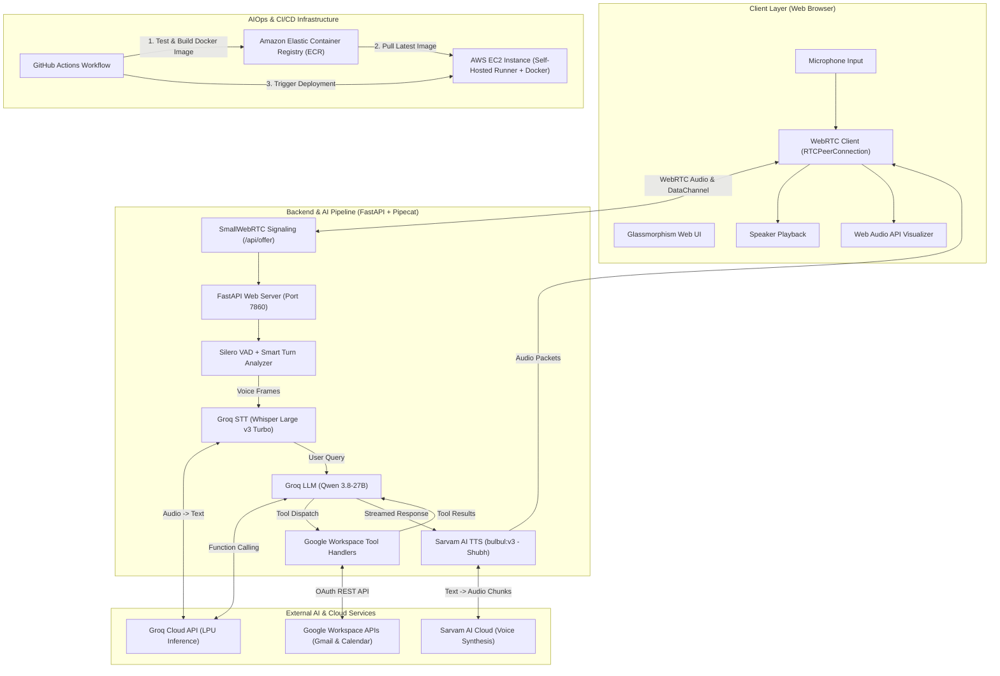

# 🎙️ Pipecat Real-Time Voice Agent & AIOps Architecture

A comprehensive end-to-end guide detailing the **Voice Agent AI Pipeline**, **Glassmorphism Web Frontend**, **Modular Backend Architecture**, and **AIOps / CI/CD Cloud Deployment** on AWS.

---

## 🏛️ High-Level System Architecture



---

## 1️⃣ The Voice Agent Pipeline (End-to-End Flow)

### A. Real-Time Audio Capture & WebRTC Signaling
1. **User Audio Input:** The user speaks into the microphone. The browser captures audio using `navigator.mediaDevices.getUserMedia` with echo cancellation, noise suppression, and auto gain control.
2. **WebRTC Peer Connection:** The browser establishes an ultra-low-latency `RTCPeerConnection` with the backend via `POST /api/offer` (SDP exchange) and `PATCH /api/offer` (ICE candidates).
3. **DataChannel:** A bidirectional RTVI (Real-Time Voice Intelligence) data channel transmits live transcriptions, assistant speaking states, and tool notifications to the UI.

### B. Voice Activity Detection (VAD) & Turn Analysis
- **Silero VAD (`confidence: 0.7`, `min_volume: 0.6`):** Detects when the user begins speaking (`0.2s`) and when they finish (`0.8s`).
- **Local Smart Turn Analyzer V3:** Intelligently identifies true pauses vs. end-of-turn statements to prevent premature interruptions.

### C. Speech-to-Text (STT)
- **Model:** `whisper-large-v3-turbo` running on **Groq Cloud**.
- **Performance:** Near-instantaneous transcription (~200ms latency), converting voice audio to English and multilingual text.

### D. Large Language Model (LLM) & Function Calling
- **Model:** `qwen/qwen3.8-27b` hosted on Groq's high-speed LPU infrastructure.
- **Universal Context Aggregator:** Maintains conversation history and binds structured function schemas (`tools_schema`).
- **Native Tool Calling:**
  - **`send_email`:** Collects `to`, `subject`, and `body` to dispatch real emails via Gmail API.
  - **`create_calendar_event`:** Collects `summary`, `description`, `start_datetime`, and `end_datetime` to schedule events on Google Calendar.

### E. Text-to-Speech (TTS)
- **Model:** Sarvam AI **`bulbul:v3`** (Voice ID: **`shubh`**, Language: **`en-IN`**).
- **Audio Output:** Expressive, natural voice synthesis converted into WebRTC audio frames and played back in real time through the user's browser.

---

## 2️⃣ Frontend Architecture

```
frontend/
├── index.html        # Modern semantic single-page UI
├── css/
│   └── styles.css    # Dark-mode glassmorphism design system
└── js/
    ├── app.js        # Event controller & transcript timeline manager
    ├── visualizer.js # Web Audio API canvas frequency visualizer
    └── webrtc.js     # WebRTC client manager & ICE candidate patcher
```

- **Glowing Voice Orb:** Dynamic breathing halo animations reflecting `Disconnected`, `Listening`, `Thinking`, and `Speaking` states.
- **Audio Frequency Canvas:** HTML5 canvas frequency visualizer rendering real-time glowing neon spectrum bars.
- **Live Activity Feed:** Message bubbles with speaker badges, timestamps, and live **Tool Execution Cards** for Gmail & Calendar actions.
- **Multi-Input Fallback:** On-screen mute toggle and a text input bar.

---

## 3️⃣ Project Modular Code Structure

```
VoiceAgent/
├── bot.py                        # Voice bot entrypoint & Pipecat pipeline assembler
├── server.py                     # Unified FastAPI server hosting Web UI & WebRTC API
├── config.py                     # Centralized settings & environment variable loader
├── requirements.txt              # Standardized lightweight dependencies
├── Dockerfile                    # Production container specification (CPU-only PyTorch)
├── .dockerignore                 # Excludes secrets and build caches
├── .github/workflows/main.yml    # Automated AWS ECR & EC2 CI/CD pipeline
├── src/
│   ├── services/
│   │   ├── groq_service.py       # Initializers for Groq STT and Groq Qwen LLM
│   │   └── sarvam_service.py     # Initializer for Sarvam AI bulbul:v3 TTS
│   ├── tools/
│   │   ├── schema.py             # Function calling JSON schemas for Gmail & Calendar
│   │   ├── gmail_tool.py         # Gmail API dispatch handler
│   │   └── calendar_tool.py      # Google Calendar event scheduling handler
│   └── utils/
│       └── auth.py               # Google OAuth token and credential resolver
└── tests/                        # Automated unit & pipeline verification tests
    ├── test_groq_llm.py          # Tool calling tests with Qwen 3.8-27B
    ├── test_sarvam_tts.py        # Sarvam REST & WebSocket synthesis tests
    └── test_pipeline.py          # Full end-to-end pipeline assembly test
```

---

## 4️⃣ AIOps & Cloud Deployment Pipeline (CI/CD)

```mermaid
sequenceDiagram
    autonumber
    actor Dev as Developer
    participant Git as GitHub Repository
    participant GHA as GitHub Actions (CI)
    participant ECR as Amazon ECR
    participant EC2 as AWS EC2 (Self-Hosted Runner)
    participant User as End User (Web Browser)

    Dev->>Git: git push origin main
    Git->>GHA: Trigger .github/workflows/main.yml
    
    rect rgb(20, 30, 50)
        Note over GHA: Job 1: integration (CI)
        GHA->>GHA: Linting & Unit Tests
    end

    rect rgb(20, 45, 40)
        Note over GHA,ECR: Job 2: build-and-push-ecr-image (CD)
        GHA->>GHA: Build Lightweight Docker Image (~380MB)
        GHA->>ECR: Authenticate & Push Image (:latest)
    end

    rect rgb(45, 30, 20)
        Note over GHA,EC2: Job 3: Continuous-Deployment
        GHA->>EC2: Trigger Self-Hosted EC2 Runner
        EC2->>EC2: Prune Stale Docker Images & Free Disk Space
        EC2->>ECR: Pull Latest Container Image
        EC2->>EC2: Stop Old Container & Run New 'voice-agent' (Port 7860)
    end

    User->>EC2: Access http://<EC2_IP>:7860
    EC2-->>User: Serve Glassmorphism Web UI & WebRTC Audio Stream
```



### Key AIOps Optimizations:
1. **Lightweight Containerization (90% Size Reduction):**
   - Configured CPU-only PyTorch (`--index-url https://download.pytorch.org/whl/cpu`) in `Dockerfile`, shrinking the image from **4.5 GB to ~380 MB** to prevent disk exhaustion.
2. **Automated EC2 Disk Management:**
   - Pre-deployment pruning (`docker system prune -af --volumes`) in the CI/CD pipeline keeps disk usage low.
3. **Zero-Downtime Container Lifecycle:**
   - Gracefully stops older containers and replaces them with `--restart always` policy.
4. **Environment Secret Isolation:**
   - Protected secrets (`GROQ_API_KEY`, `SARVAM_API_KEY`, AWS credentials) injected securely at runtime without baking keys into images.

---

### 🌐 Accessing the Live App
Once deployed on your EC2 instance:
👉 **`http://<YOUR_EC2_PUBLIC_IP>:7860/`**
