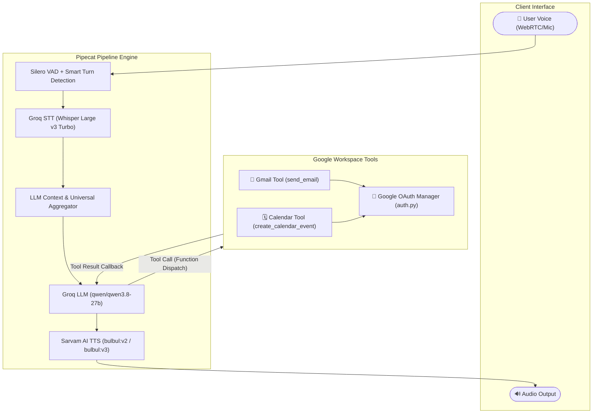

# 🎙️ Pipecat Voice Agent (Groq Qwen 3.8-27B + Sarvam AI TTS)

A production-ready, ultra-low-latency real-time voice agent built with the **Pipecat** framework, powered by **Groq's fast inference** (Whisper Turbo STT & Qwen 3.8-27B with function calling) and **Sarvam AI's expressive Text-to-Speech (TTS)** for Indian languages and English.

---

## 🌟 Architecture Overview

The voice agent connects audio inputs via WebSockets/WebRTC, performs Voice Activity Detection (VAD) with Silero, transcribes speech with Groq Whisper Turbo, reasons and triggers Google Workspace tools using Groq `qwen/qwen3.8-27b`, and synthesizes responses using Sarvam AI TTS (`bulbul:v2` / `bulbul:v3`).



---

## 🚀 Key Features

- **⚡ Fast Inference with Groq Cloud**:
  - **Speech-to-Text**: `whisper-large-v3-turbo` for near-instant transcription.
  - **Language Model**: `qwen/qwen3.8-27b` optimized for reliable multi-turn tool calling and structured function execution.
- **🇮🇳 Expressive Indian TTS by Sarvam AI**:
  - Native support for Indian accents and 10+ Indian languages + Indian English (`en-IN`).
  - Supports both **real-time WebSocket streaming** (`SarvamTTSService`) and **HTTP batch fallback** (`SarvamHttpTTSService`).
  - Customizable voices (`anushka`, `shubh`, `vidya`, `rohan`, `priya`, `aditya`, etc.), pace, pitch, and loudness.
- **🛠️ Google Workspace Tool Integration**:
  - **Gmail Tool (`send_email`)**: Sends emails via Gmail API with recipient validation and formatting.
  - **Google Calendar Tool (`create_calendar_event`)**: Schedules events with timezone and attendee support.
- **📁 Clean Modular Project Structure**: Separated into `config/`, `services/`, `tools/`, `utils/`, and `tests/`.

---

## 📂 Repository Structure

```
VoiceAgent/
├── .env                          # Local environment keys (GROQ_API_KEY, SARVAM_API_KEY)
├── .env.example                  # Environment configuration template
├── .gitignore                    # Git ignore file for secrets and cached artifacts
├── requirements.txt              # Project dependencies
├── README.md                     # Documentation & user guide
├── config.py                     # Centralized settings & environment loader
├── bot.py                        # Primary WebRTC Voice Bot entrypoint
├── src/
│   ├── __init__.py
│   ├── services/                 # AI Service initializers
│   │   ├── __init__.py
│   │   ├── groq_service.py       # Groq STT & Groq LLM (Qwen 3.8-27B) factories
│   │   └── sarvam_service.py     # Sarvam TTS (WebSocket & HTTP) factories
│   ├── tools/                    # Tool schemas and function handlers
│   │   ├── __init__.py
│   │   ├── schema.py             # Pipecat FunctionSchema & ToolsSchema definitions
│   │   ├── gmail_tool.py         # Gmail send_email tool & Pipecat handler
│   │   └── calendar_tool.py      # Google Calendar create_calendar_event tool & handler
│   └── utils/                    # Shared utilities
│       ├── __init__.py
│       └── auth.py               # Google OAuth credentials manager
└── tests/                        # Automated unit & integration tests
    ├── __init__.py
    ├── test_sarvam_tts.py        # Sarvam TTS REST & Pipecat service test
    ├── test_groq_llm.py          # Groq Qwen 3.8-27B tool calling verification
    └── test_pipeline.py          # Pipeline component assembly test
```

---

## 🛠️ Setup & Installation

### 1. Prerequisites
- **Python 3.10+** (Tested on Python 3.12)
- **Groq API Key**: [Get a free Groq API key](https://console.groq.com/keys)
- **Sarvam AI API Key**: [Get a free Sarvam API key](https://dashboard.sarvam.ai)
- **Google Cloud OAuth Credentials** (Optional for Gmail & Calendar):
  - Enable **Gmail API** and **Google Calendar API** in Google Cloud Console.
  - Create OAuth Client ID (Desktop App) and download JSON as `credentials.json`.

### 2. Install Dependencies
```bash
pip install -r requirements.txt
```

### 3. Configure Environment Variables
Copy `.env.example` to `.env` and provide your API keys:
```env
GROQ_API_KEY=gsk_...
SARVAM_API_KEY=sk_...
GROQ_LLM_MODEL=qwen/qwen3.8-27b
GROQ_STT_MODEL=whisper-large-v3-turbo
SARVAM_TTS_MODEL=bulbul:v2
SARVAM_TTS_VOICE=anushka
SARVAM_TTS_LANGUAGE=en-IN
SARVAM_TTS_STREAMING=true
```

---

## 🧪 Testing the Integration

We provide automated test scripts to verify every component independently before starting the voice agent.

### 1. Test Sarvam AI TTS
Verifies the REST API endpoint and the Pipecat Sarvam TTS service factories:
```bash
python tests/test_sarvam_tts.py
```

### 2. Test Groq Qwen 3.8-27B Tool Calling
Verifies that Groq's `qwen/qwen3.8-27b` model properly inspects user queries and calls `send_email` and `create_calendar_event`:
```bash
python tests/test_groq_llm.py
```

### 3. Test Full Pipeline Assembly
Verifies that STT, LLM, TTS, context aggregators, and RTVI assemble properly:
```bash
python tests/test_pipeline.py
```

---

## 🌐 Modern Glassmorphism Web Frontend

The project includes a web UI featuring:
- **Glowing Voice Orb**: Visual pulse indicators for Listening, Thinking, Speaking, and Disconnected states.
- **Real-Time Audio Waveform Canvas**: Audio-reactive frequency visualizer powered by Web Audio API.
- **Live Conversation Feed**: Color-coded chat bubbles with timestamps and transcript logs.
- **Interactive Tool Execution Cards**: Visual cards displaying Gmail recipient/subject and Google Calendar event schedules as they are executed.
- **Microphone Controls & Text Chat Fallback**: Real-time mute toggles and keyboard text input.

---

## 🚀 Running the Voice Bot & Web UI

Launch the unified server and web interface:
```bash
python server.py
# Or simply:
python bot.py
```

Then open **`http://localhost:7860`** in your browser.

---

---

## ☁️ Automated AWS EC2 Deployment (GitHub Actions)

A complete CI/CD pipeline is configured in [`.github/workflows/main.yml`](.github/workflows/main.yml). On every push to `main`, GitHub Actions automatically:
1. Tests Python syntax and validates the Docker build.
2. Connects to your AWS EC2 instance via SSH.
3. Automatically updates code, builds the container, and starts the server on port `7860`.

### 🔑 Required GitHub Secrets
Navigate to **GitHub Repository → Settings → Secrets and variables → Actions** and add:

#### 1. AWS EC2 Connection Secrets:
- `EC2_HOST`: Public IP / DNS of your EC2 instance (e.g., `54.210.xx.xx`)
- `EC2_USER`: SSH user (e.g., `ubuntu` or `ec2-user`)
- `EC2_SSH_KEY`: Content of your `.pem` private key

#### 2. Application API Secrets (Only 2 needed!):
- `GROQ_API_KEY`: Your Groq Cloud API Key
- `SARVAM_API_KEY`: Your Sarvam AI API Key

*(All model names, voice IDs, ports, and hosts are automatically pre-configured with optimized production defaults).*

> [!TIP]
> Ensure your **EC2 Security Group** has inbound rules allowing:
> - **Port 22 (SSH)** from GitHub Actions / your IP.
> - **Port 7860 (Custom TCP)** from `0.0.0.0/0` (Anywhere) to access the Voice Agent Web UI.

## 📖 Tool Specifications

### `send_email`
Sends an email message via Gmail.
- `to` (*string*, required): Destination email address.
- `subject` (*string*, required): Subject line.
- `body` (*string*, required): Plain text message body.

### `create_calendar_event`
Schedules an event on Google Calendar.
- `summary` (*string*, required): Title of the event.
- `description` (*string*, required): Detailed description.
- `start_datetime` (*string*, required): ISO 8601 string (e.g., `2026-03-01T10:00:00+05:30`).
- `end_datetime` (*string*, required): ISO 8601 string (e.g., `2026-03-01T11:00:00+05:30`).
- `timezone` (*string*, optional): Timezone (default: `"Asia/Kolkata"`).
- `attendees` (*array of strings*, optional): List of attendee emails.

---

## ⚙️ Configuration Reference

| Variable | Default | Description |
|---|---|---|
| `GROQ_API_KEY` | *(Required)* | Groq API Key |
| `GROQ_LLM_MODEL` | `qwen/qwen3.8-27b` | Model used for LLM inference & tool calling |
| `GROQ_STT_MODEL` | `whisper-large-v3-turbo` | Model used for Speech-to-Text |
| `SARVAM_API_KEY` | *(Required)* | Sarvam AI API Key |
| `SARVAM_TTS_MODEL` | `bulbul:v2` | Sarvam TTS model (`bulbul:v2` or `bulbul:v3`) |
| `SARVAM_TTS_VOICE` | `anushka` | Speaker voice (`anushka`, `shubh`, `vidya`, etc.) |
| `SARVAM_TTS_LANGUAGE` | `en-IN` | Target language code (`en-IN`, `hi-IN`, etc.) |
| `SARVAM_TTS_STREAMING` | `true` | Enables WebSocket streaming for real-time TTS |
| `GOOGLE_CREDENTIALS_PATH` | `credentials.json` | Path to Google OAuth Client Secrets JSON |
| `GOOGLE_TOKEN_PATH` | `token.json` | Path to saved Google OAuth user token |
